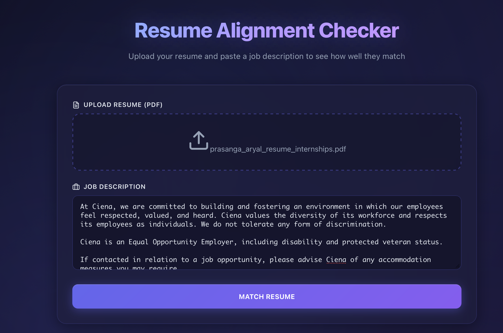
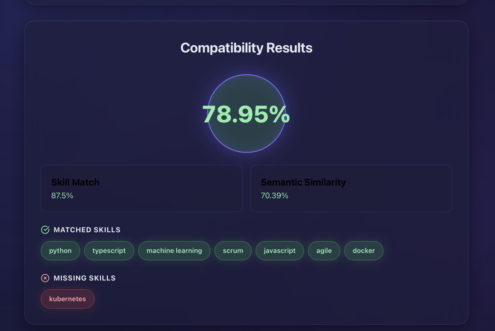

# Resume Compatibility Checker

## Overview

This project creates a **resume compatibility checker** to check the alignment of a resume based on job descriptions. 

The program is written in **Python** and frontend was build using **React**.

-----

## Running the Program

To compile and run the program, open two instances of terminal (one for frontend and one for backend).

Open the frontend directory and follow the following instructions:
- Install all required packages using:
```
npm install
```
- Run the frontend:
```
npm run dev
```

Now, open the backend:
- Create a virtual environment to install packages and then run:
```
pip3 install -r requirements.txt
```
- Then, run the backend file:
```
python3 app.py
```


## Screenshots


