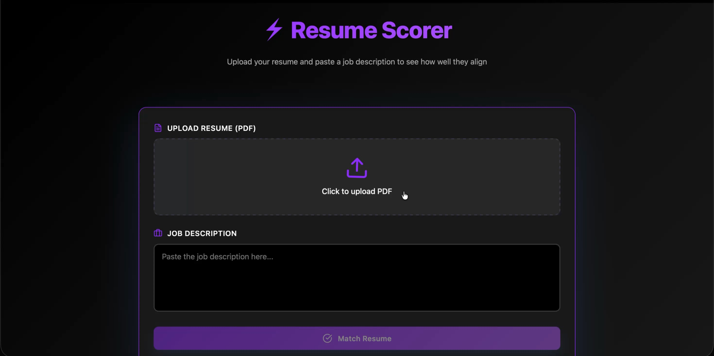

# Resume Scorer

## Overview

Resume Scorer is a resume matching platform that analyzes resume-to-job compatibility using transformer-based semantic similarity, skill extraction, and section-aware scoring.

The system combines NLP techniques, embedding-based semantic analysis, and explainable recommendations to evaluate how well a candidate aligns with a target role.

This project utilizes the following tech stacks:

* **Python**
* **Flask**
* **Sentence-Transformers**
* **React**
* **NumPy**
* **pdfplumber**

---

## Features

* Semantic resume-to-job matching using transformer embeddings
* Section-aware scoring for:
  * Skills
  * Experience
  * Projects
  * Education
* Skill extraction and normalization
* Explainable compatibility recommendations
* PDF resume parsing
* RESTful Flask APIs
* React frontend for interactive analysis

---

## Tech Stack

### Backend

* Python
* Flask
* Sentence-Transformers
* NumPy
* pdfplumber

### Frontend

* React
* JavaScript
* Vite

---

## Project Architecture

```text
Frontend (React)
        ↓
Flask REST API
        ↓
Resume Processing Pipeline
        ↓
Embedding + Skill Matching
        ↓
Section-Aware Compatibility Scoring
        ↓
Explainable Recommendations
```

---

## Demo



---

## Running the Project

Open two terminal instances:

* one for the frontend
* one for the backend

---

## Frontend Setup

Navigate to the frontend directory:

```bash
cd frontend
```

Install dependencies:

```bash
npm install
```

Run development server:

```bash
npm run dev
```

---

## Backend Setup

Navigate to the backend directory:

```bash
cd backend
```

Create and activate a virtual environment:

### macOS / Linux

```bash
python3 -m venv venv
source venv/bin/activate
```

### Windows

```bash
python -m venv venv
venv\Scripts\activate
```

Install dependencies:

```bash
pip install -r requirements.txt
```

Run backend server:

```bash
python app.py
```

---

## License

This project is licensed under the MIT License.
